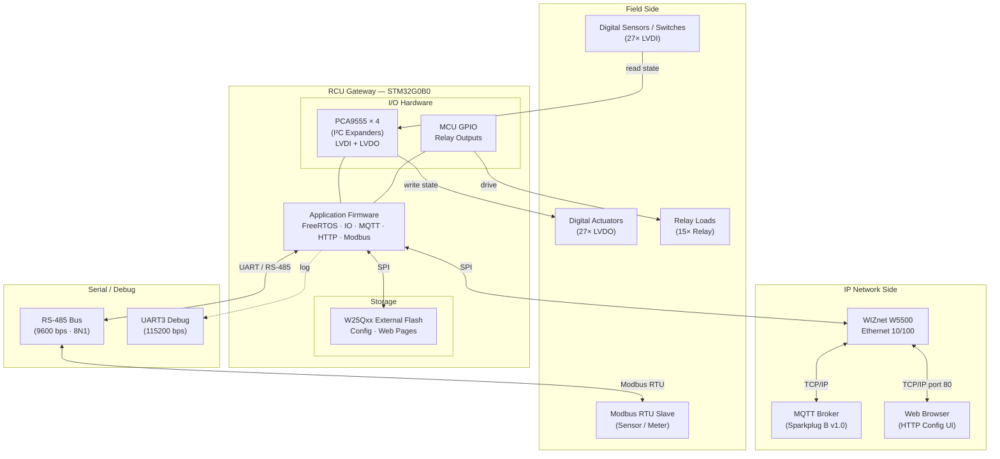

# Universal IO — User Guide

**Firmware Platform:** Universal IO v1  
**Document Revision:** 1.0  

---

## Table of Contents

1. [Product Overview](#1-product-overview)
2. [Hardware Description](#2-hardware-description)
3. [Getting Started](#3-getting-started)
4. [Web Interface](#4-web-interface)
   - 4.1 [Dashboard](#41-dashboard)
   - 4.2 [IO Control Panel](#42-io-control-panel)
   - 4.3 [System Information Page](#43-system-information-page)
   - 4.4 [Network Configuration](#44-network-configuration)
   - 4.5 [MQTT Configuration](#45-mqtt-configuration)
   - 4.6 [Modbus RTU Configuration](#46-modbus-rtu-configuration)
5. [IO Channels Reference](#5-io-channels-reference)
6. [MQTT Integration](#6-mqtt-integration)
   - 6.1 [Topic Structure](#61-topic-structure)
   - 6.2 [Device → Broker Messages](#62-device--broker-messages)
   - 6.3 [Broker → Device Commands](#63-broker--device-commands)
   - 6.4 [Payload Binary Formats](#64-payload-binary-formats)
7. [Modbus RTU Integration](#7-modbus-rtu-integration)
8. [REST API Reference](#8-rest-api-reference)
9. [Factory Default Settings](#9-default-settings)
10. [Troubleshooting](#10-troubleshooting)

---

## 1. Product Overview

The **RCU Gateway** is an embedded industrial I/O gateway built on the STM32G0B0 microcontroller. It bridges physical field I/O (digital inputs, digital outputs, relay outputs) with IP networks using the **MQTT protocol** and exposes a local **HTTP web interface** for configuration and control.

It also acts as a **Modbus RTU master** that can poll field sensors and forward their readings over MQTT to a broker.

**Key capabilities:**

| Feature | Details |
|---|---|
| Digital Inputs (LVDI) | 27 channels |
| Digital Outputs (LVDO) | 27 channels |
| Relay Outputs | 15 channels |
| Ethernet | 10/100 Mbps via WIZnet W5500 |
| MQTT | Sparkplug B v1.0 protocol |
| Modbus | RTU Master on RS-485 at 9600 bps |
| Web UI | Built-in HTTP server on port 80 |
| Configuration storage | Persistent in external flash (W25Qxx) |

### System Block Diagram



---

## 2. Hardware Description

### 2.1 Ethernet Port

Connect a standard RJ-45 Ethernet cable to the device LAN port. The device communicates at 10/100 Mbps. The default MAC address is `00:08:DC:01:02:03`.

### 2.2 RS-485 Port (Modbus RTU)

The RS-485 port is used by the built-in Modbus RTU master to poll connected slave devices (sensors, actuators). The baud rate is fixed at **9600 bps** in firmware. Connect RS-485 A/B lines to the corresponding terminals on the device.

### 2.3 Serial Debug Port

A 3.3 V UART debug port (UART3, TX on PC4, RX on PC5) is available for diagnostic output at **115200 baud, 8N1**. Connect a USB-to-serial adapter to this port to view real-time system logs. This is read-only information — no command interface is provided over the debug port.

### 2.4 Digital I/O

All 27 LVDI (low-voltage digital inputs) and 27 LVDO (low-voltage digital outputs) are managed by PCA9555 I²C expanders. Refer to the hardware schematic for wiring details and voltage levels.

### 2.5 Relay Outputs

The 15 relay outputs are directly driven by MCU GPIO. Refer to the hardware schematic for maximum load ratings.

---

## 3. Getting Started

### 3.1 First Power-On

1. Connect the Ethernet cable to your LAN switch.
2. Apply power to the device.
3. Wait approximately **3–5 seconds** for the device to initialize Ethernet and start all services.
4. Observe the debug serial port (optional) to confirm the device has obtained its IP address and connected to the MQTT broker.

### 3.2 Access the Web Interface

By default the device uses the static IP address **192.168.1.20**. On a PC connected to the same LAN, open a web browser and navigate to:

```
http://192.168.1.20
```

You should see the device dashboard. If the page does not load, verify that:

- The PC and device are on the same subnet (`192.168.1.x`, subnet `255.255.255.0`)
- No firewall is blocking port 80

### 3.3 Change the IP Address

To assign a different static IP address, navigate to the **Network Configuration** page (see Section 4.4) or use the REST API (see Section 8.5). Changes take effect immediately; reconnect your browser to the new IP address.

---

## 4. Web Interface

All web pages are served from the device's built-in HTTP server on port 80. No account login is required.

### 4.1 Dashboard

**URL:** `http://<device-ip>/`


The home page provides a quick overview and navigation links to all configuration and control sections.

### 4.2 IO Control Panel

**URL:** `http://<device-ip>/tnc`

This page displays the real-time state of all IO channels and allows individual control of outputs.


| Section | Description |
|---|---|
| Digital Inputs (LVDI 1–27) | Read-only. Shows current state of each input: **ON** (1) or **OFF** (0). |
| Digital Outputs (LVDO 1–27) | Read-write. Click a channel to toggle its output state. |
| Relay Outputs (Relay 1–15) | Read-write. Click a channel to toggle the relay. |

The page polls the device every second to refresh the displayed states automatically.

### 4.3 System Information Page

**URL:** `http://<device-ip>/info`

Displays read-only system information:

| Field | Description |
|---|---|
| Device name | Fixed identifier |
| IP Address | Current IP address |
| Subnet Mask | Current subnet |
| Gateway | Current gateway |
| DNS | Current DNS server |
| MQTT Broker | Currently configured broker IP |
| MQTT Port | Currently configured port |
| MQTT Username | Currently configured username |
| Uptime | Seconds since last power-on |

### 4.4 Network Configuration

**URL:** `http://<device-ip>/network_config`

Configure the device's Ethernet interface. All fields are static (DHCP is not supported).

| Field | Description | Example |
|---|---|---|
| IP Address | Device static IP | `192.168.1.20` |
| Subnet Mask | Network mask | `255.255.255.0` |
| Default Gateway | Router address | `192.168.1.1` |
| DNS Server | DNS resolver | `8.8.8.8` |

Click **Save** to apply. The new settings take effect immediately without a device reboot. Reconnect your browser to the new IP.

> **Note:** If you save an incorrect IP and lose access, reflash the firmware.

### 4.5 MQTT Configuration

**URL:** `http://<device-ip>/mqtt_config`

Configure the MQTT broker connection. Changes are saved to flash and take effect immediately — the device disconnects from the current broker and reconnects to the new one.

| Field | Description | Default |
|---|---|---|
| Broker IP | IPv4 address of MQTT broker | `192.168.1.225` |
| Port | TCP port | `1883` |
| Client ID | MQTT client identifier | `RCU-01` |
| Username | Broker authentication username | `rcu01` |
| Password | Broker authentication password | `123456` |

> **Note:** TLS/SSL is not supported in the current firmware version. Use broker-side network isolation or a VPN for secure deployments.

The Sparkplug B Group ID (`RCU`) and Edge Node ID (`RCU-01`) are currently fixed to the Client ID value. Changing the Client ID also changes the Sparkplug B node ID used in MQTT topic paths.

### 4.6 Modbus RTU Configuration

**URL:** `http://<device-ip>/modbus_config`

Configure the Modbus RTU master. Changes take effect immediately without a reboot.

| Field | Description | Default | Range |
|---|---|---|---|
| Slave ID | Modbus slave address of the target sensor | `1` | 1 – 247 |
| Data Type | Which registers to read from the slave | `0` (Temp + Humidity) | See below |
| Poll Interval (ms) | How often to poll the slave | `5000` | 100 – 60000 |

**Data Type values:**

| Value | Label | Registers Read |
|---|---|---|
| `0` | Temperature + Humidity | Reg 0 (Temp), Reg 1 (Humidity) — single FC03 request |
| `1` | Temperature only | Reg 0 (Temp) — FC03 |
| `2` | Humidity only | Reg 1 (Humidity) — FC03 |

> **Note:** The RS-485 baud rate is fixed at **9600 bps** and cannot be changed through the web interface.

---

## 5. IO Channels Reference

All channel indices are **1-based** throughout the web interface, REST API, and MQTT payloads.

### 5.1 Digital Inputs (LVDI)

| Index Range | Hardware Source | Notes |
|---|---|---|
| 1 – 27 | PCA9555 I²C expanders | Read-only. Reflect external field signal state. |

### 5.2 Digital Outputs (LVDO)

| Index Range | Hardware Source | Notes |
|---|---|---|
| 1 – 27 | PCA9555 I²C expanders | Writable via web, API, or MQTT command. |

### 5.3 Relay Outputs

| Index Range | Hardware Source | Notes |
|---|---|---|
| 1 – 15 | MCU GPIO | Writable via web, API, or MQTT command. |

### 5.4 IO Event Publishing

By default the device publishes an IO state snapshot to MQTT whenever **any** input or output state changes. If the MQTT periodic publish interval is set to a value greater than 0, the device also publishes at that fixed interval regardless of change events.

---

## 6. MQTT Integration

The device uses the **Sparkplug B v1.0** specification over standard MQTT. All Sparkplug payloads from this device use a **raw binary** encoding (not Google Protobuf) as described in Section 6.4.

### 6.1 Topic Structure

Topic format:

```
spBv1.0/<group_id>/<message_type>/<edge_node_id>[/<device_id>]
```

With factory defaults (`group_id = RCU`, `edge_node_id = RCU-01`):

| Pattern | Example |
|---|---|
| Node messages | `spBv1.0/RCU/<type>/RCU-01` |
| Device messages | `spBv1.0/RCU/<type>/RCU-01/IO` |
| Modbus messages | `spBv1.0/RCU/<type>/RCU-01/MODBUS` |

### 6.2 Device → Broker Messages

| Topic | Trigger | Description |
|---|---|---|
| `spBv1.0/RCU/NBIRTH/RCU-01` | On MQTT connect | Node birth certificate; signals device is online |
| `spBv1.0/RCU/NDEATH/RCU-01` | On disconnect (LWT) | Node death; signals device went offline |
| `spBv1.0/RCU/NDATA/RCU-01` | Alarm event | Alarm notification (Modbus timeout, IO expander fault, watchdog reset) |
| `spBv1.0/RCU/DDATA/RCU-01/IO` | IO state change or periodic interval | Full snapshot of all 27 DI, 27 DO, 15 Relay states |
| `spBv1.0/RCU/DDATA/RCU-01/MODBUS` | After each Modbus poll completes | Result of the latest register read from the slave |

### 6.3 Broker → Device Commands

| Topic | Purpose |
|---|---|
| `spBv1.0/RCU/DCMD/RCU-01/IO` | Write a single LVDO or Relay output (3-byte payload) |
| `spBv1.0/RCU/DCMD/RCU-01/MODBUS` | Send an on-demand Modbus request to the slave (6-byte payload) |

### 6.4 Payload Binary Formats

#### IO State Payload (73 bytes)

Published to `.../DDATA/.../IO`. Total length is always 73 bytes.

```
Byte 0    : 0x01  — payload type (IO state)
Byte 1    : 0x1B  — LVDI channel count (27)
Bytes 2–28: LVDI state, one byte per channel (0=OFF, 1=ON)
Byte 29   : 0x1B  — LVDO channel count (27)
Bytes 30–56: LVDO state, one byte per channel (0=OFF, 1=ON)
Byte 57   : 0x0F  — Relay count (15)
Bytes 58–72: Relay state, one byte per channel (0=OFF, 1=ON)
```

All channel arrays are ordered from index 1 (first byte) to index 27/15 (last byte).

#### Modbus Data Payload (7 bytes)

Published to `.../DDATA/.../MODBUS`.

```
Byte 0: 0x02         — payload type (Modbus data)
Byte 1: slave_id     — Modbus slave address
Byte 2: fc           — Function code used
Byte 3: register_hi  — Register address high byte
Byte 4: register_lo  — Register address low byte
Byte 5: value_hi     — Register value high byte  (big-endian)
Byte 6: value_lo     — Register value low byte
```

#### Alarm Payload (variable length, minimum 3 bytes)

Published to `.../NDATA/...`.

```
Byte 0    : 0x03          — payload type (alarm)
Byte 1    : alarm_code    — see table below
Byte 2    : msg_len       — length of the message string
Bytes 3…N : msg_bytes     — ASCII diagnostic message
```

**Alarm codes:**

| Code | Meaning |
|---|---|
| `0x01` | Modbus RTU slave unreachable / request timeout |
| `0x02` | IO expander (PCA9555) I²C communication error |
| `0x03` | Watchdog triggered / abnormal restart detected |

> **Alarm suppression:** Modbus timeout alarms require **3 consecutive failures** before the alarm is published, then a **5-second cooldown** between subsequent alarm messages to prevent message flooding.

#### IO Write Command Payload (3 bytes)

Sent by the broker to `.../DCMD/.../IO`.

```
Byte 0: target  — 0x01=LVDO, 0x02=Relay
Byte 1: pin_id  — 1-based channel number
Byte 2: state   — 0=OFF, 1=ON
```

**Example:** Turn Relay 3 ON → `02 03 01`

#### Modbus Command Payload (6 bytes)

Sent by the broker to `.../DCMD/.../MODBUS`. Triggers an immediate Modbus transaction; the result is published to `.../DDATA/.../MODBUS`.

```
Byte 0: slave_id  — target slave address (1–247)
Byte 1: fc        — Modbus function code
Byte 2: reg_hi    — register/coil address high byte
Byte 3: reg_lo    — register/coil address low byte
Byte 4: val_hi    — coil count or write value high byte
Byte 5: val_lo    — coil count or write value low byte
```

**Supported function codes:**

| FC (hex) | Name |
|---|---|
| `0x01` | Read Coils |
| `0x02` | Read Discrete Inputs |
| `0x03` | Read Holding Registers |
| `0x04` | Read Input Registers |
| `0x05` | Write Single Coil |
| `0x06` | Write Single Register |
| `0x0F` | Write Multiple Coils |
| `0x10` | Write Multiple Registers |

Maximum quantity per request: **32 registers or coils**.

---

## 7. Modbus RTU Integration

### 7.1 Overview

The device operates as a **Modbus RTU Master** on the RS-485 bus. It periodically polls a single configured slave and publishes the results via MQTT. The baud rate is fixed at **9600 bps** with no parity, 8 data bits, 1 stop bit (8N1).

### 7.2 Automatic Polling

The device polls the configured slave at the interval defined on the Modbus configuration page. Each poll result is published to:

```
spBv1.0/<group_id>/DDATA/<node_id>/MODBUS
```

### 7.3 On-Demand Modbus Requests

In addition to automatic polling, you can trigger a one-off Modbus transaction in two ways:

**Via MQTT command** (see Section 6.3 and 6.4 — Modbus Command Payload).

**Via REST API:**

```
POST /api/modbus
Content-Type: application/json

{"slave_id": 1, "fc": 3, "reg": 0, "val": 2}
```

The result is published to the MQTT topic `spBv1.0/RCU/DDATA/RCU-01/MODBUS`.

### 7.4 Default Sensor Register Map

The device is pre-configured for a temperature/humidity sensor with the following register layout:

| Register | Contents |
|---|---|
| Holding Register 0 | Temperature |
| Holding Register 1 | Humidity |

When `Data Type = 0` (Temperature + Humidity), both registers are read in a single FC03 request (starting address 0, quantity 2).

---

## 8. REST API Reference

All endpoints are available on **port 80** over HTTP. Responses use JSON (`Content-Type: application/json`). POST endpoints accept `application/x-www-form-urlencoded` unless noted.

### 8.1 Health Check

```
GET /api/status
```

Response:
```json
{"ok": true}
```

### 8.2 IO Status

```
GET /api/io/status
```

Response:
```json
{
  "di":    [0, 1, 0, 0, ...],   // 27 elements, index 0 = LVDI-1
  "do":    [0, 0, 1, 0, ...],   // 27 elements, index 0 = LVDO-1
  "relay": [0, 0, 0, 1, ...]    // 15 elements, index 0 = Relay-1
}
```

### 8.3 Control Single Output

```
POST /api/io/tnc?type=<type>&id=<N>&val=<0|1>
```

| Parameter | Values | Description |
|---|---|---|
| `type` | `do` or `relay` | Output type |
| `id` | `1` – `27` (do) or `1` – `15` (relay) | 1-based channel number |
| `val` | `0` or `1` | Desired state |

Response:
```json
{"ok": true}
```

### 8.4 Set All Outputs of One Type

```
POST /api/io/all?type=<type>&val=<0|1>
```

Sets every channel of the specified type to the same state at once.

| Parameter | Values |
|---|---|
| `type` | `do` or `relay` |
| `val` | `0` or `1` |

Response:
```json
{"ok": true}
```

### 8.5 Network Configuration

Read current settings:
```
GET /api/network/info
```
Response:
```json
{"ip": "192.168.1.20", "subnet": "255.255.255.0", "gateway": "192.168.1.1", "dns": "8.8.8.8"}
```

Save new settings (reconnects immediately):
```
POST /api/network
Body: ip=<ip>&subnet=<mask>&gateway=<gw>&dns=<dns>
```

### 8.6 MQTT Configuration

Read current settings:
```
GET /api/mqtt/info
```
Response:
```json
{"broker": "192.168.1.225", "port": "1883", "client_id": "RCU-01", "username": "rcu01"}
```

Save and reconnect:
```
POST /api/mqtt/config
Body: broker=<ip>&port=<port>&client_id=<id>&username=<user>&password=<pass>
```

### 8.7 Modbus Configuration

Read current settings:
```
GET /api/modbus/info
```
Response:
```json
{"slave_id": 1, "data_type": 0, "interval_ms": 5000}
```

Save and reinitialize:
```
POST /api/modbus/config
Body: slave_id=<id>&data_type=<type>&interval_ms=<ms>
```

### 8.8 System Information

```
GET /api/system/info
```

Response includes: device name, IP, DNS, Subnet, Gateway, MQTT Broker, MQTT Port, MQTT Username, MQTT Password, uptime (seconds).

### 8.9 On-Demand Modbus Request

```
POST /api/modbus
Content-Type: application/json

{"slave_id": 1, "fc": 3, "reg": 0, "val": 2}
```

`val` is the coil/register count for read operations, or the value to write for write operations. The Modbus response is published to MQTT rather than returned in the HTTP response body.

---

## 9. Default Settings

### Network

| Parameter | Default |
|---|---|
| IP Address | `192.168.1.20` |
| Subnet Mask | `255.255.255.0` |
| Default Gateway | `192.168.1.1` |
| DNS Server | `8.8.8.8` |
| MAC Address | `00:08:DC:01:02:03` |

### MQTT

| Parameter | Default |
|---|---|
| Broker IP | `192.168.1.225` |
| Port | `1883` |
| Client ID | `RCU-01` |
| Username | `rcu01` |
| Password | `123456` |
| Sparkplug B Group ID | `RCU` |
| Sparkplug B Edge Node ID | `RCU-01` |
| Keep-alive interval | `60 seconds` |

### Modbus RTU

| Parameter | Default |
|---|---|
| Slave ID | `1` |
| Data Type | `0` (Temperature + Humidity) |
| Poll Interval | `5000 ms` |
| Baud Rate | `9600 bps` (fixed) |

---

## 10. Troubleshooting

### Cannot reach web interface

| Check | Action |
|---|---|
| PC on same subnet? | Set PC IP to `192.168.1.x` with subnet `255.255.255.0` |
| Previously changed IP? | Connect via debug serial to see current IP in startup log |
| Firewall blocking port 80? | Disable firewall temporarily to test |

### MQTT not connecting / no data on broker

| Check | Action |
|---|---|
| Broker reachable from device LAN? | Ping broker IP from a PC on the same subnet |
| Broker IP correct? | Open `/mqtt_config` page and verify the broker IP |
| Port 1883 open on broker? | Verify broker is listening; check broker firewall rules |
| Credentials rejected? | Check broker access control list matches username/password |

### Modbus Alarm 0x01: Slave unreachable

| Check | Action |
|---|---|
| RS-485 wiring | Verify A/B polarity and termination resistor |
| Slave power | Confirm slave device is powered and active |
| Slave ID match | Confirm slave ID on device matches slave configuration |
| Baud rate | Confirm slave is configured for 9600 bps 8N1 |

### IO Expander Alarm 0x02

This alarm indicates an I²C communication error with one of the PCA9555 expander chips. Possible causes:

- Loose internal I²C connector or solder joint
- Power supply instability
- Electrostatic damage to the expander chip

Contact hardware support if this alarm persists after a power cycle.

### Outputs not responding to web commands

| Check | Action |
|---|---|
| IO index in range? | LVDO: 1–27, Relay: 1–15. Index 0 is invalid. |
| Output type correct? | DO and Relay are separate — ensure correct `type` parameter |
| Relay contactor issue? | Verify load does not exceed relay rating |

---

*End of User Guide*
